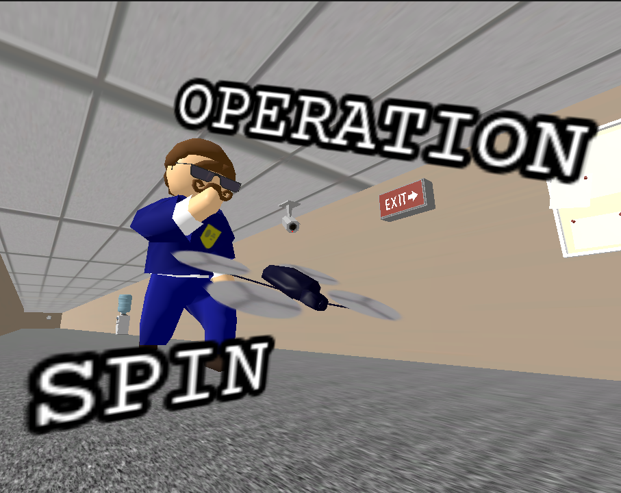

# Operation spin

A game developed in Godot in a week for [The Very Serious Juniper Dev Game Jam](https://itch.io/jam/theveryseriousjuniperdevgamejam), available to play on [itch](https://apmds.itch.io/operation-spin).

## Story

You are a spy who was tasked with getting some VERY secretive and VERY serious documents from an organization.

Instead of going there yourself, you use a remote-controlled drone because your boss wants to use the new tech and feel "hype".

The building is massive and heavily guarded, so you must wiggle your drone trough to avoid detection.

Try to not set off the alarms. Complete the mission.

## Running

There are releases available in both github and itch, but on itch there's a web build so it can be played directly from there.

## Building

The game is exported directly from godot, requiring:

- Godot Engine version >= 4.7
- Export templates (from the website or the editor itself)

The templates in the repository allow exporting to windows, linux and web. (Note: the export directories `export/web`, `export/windows` and `export/linux` must be created for the respective export to work).

## Credits

This game uses assets from:

- <a href="https://sketchfab.com/3d-models/60s-office-props-dc00ea320cfa4aad90811080270672db">60's Office Props by SeanNicolas (sketchfab)</a></li>
- <a href="https://sketchfab.com/3d-models/security-camera-7a4d8b033982421e8a1de6b52e979176">Security Camera by Llop (sketchfab)</a></li>
- An altered version of <a href="https://sketchfab.com/3d-models/low-poly-drone-3a5eba0df3154257a712fad731a3e4d2">LOW POLY DRONE by Trockk (sketchfab)</a></li>
- The texture from <a href="https://sketchfab.com/3d-models/city-rooftop-night-skybox-cce0e8aaa10f45ccb234e1aa2a3d5753">City Rooftop Night Skybox by Luis Vidal (sketchfab)</a></li>
- Some sounds from <a href="https://pixabay.com/">pixabay</a></li>
- Some textures from <a href="https://polyhaven.com/textures">Poly Haven</a></li>

